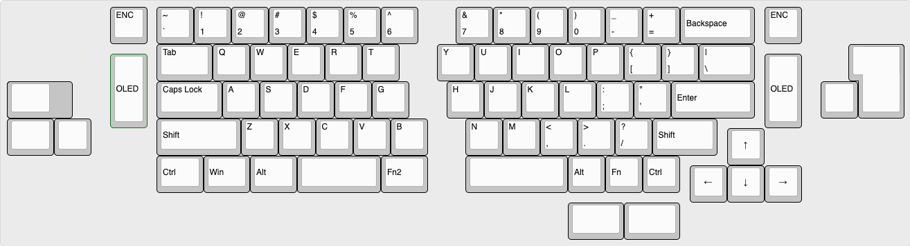

# Marvelous65 Split
A split version of my marvelous65 keyboard. powered by pro micro or any compatible footprint like nice!nano and nrfmicro. This keyboard is wireless ready, I have added JST-XH connection for battery and an on off switch for the battery connection. It have encoder and oled on both side. also I have added underglow footprint if you want to add underglow in your keyboard. 

## Layout
try it at [KLE](http://www.keyboard-layout-editor.com/##@_name=marvelous65%20split%3B&@_x:2.75%3B&=ENC&_x:0.25%3B&=~%0A%60&=!%0A1&=%2F@%0A2&=%23%0A3&=$%0A4&=%25%0A5&=%5E%0A6&_x:1%3B&=%2F&%0A7&=*%0A8&=(%0A9&=)%0A0&=%2F_%0A-&=+%0A%2F=&_a:6&w:2%3B&=Backspace&_x:0.25&a:4%3B&=ENC%3B&@_x:4&w:1.5%3B&=Tab&=Q&=W&=E&=R&=T&_x:1%3B&=Y&=U&=I&=O&=P&=%7B%0A%5B&=%7D%0A%5D&_w:1.5%3B&=%7C%0A%5C&_x:2.75&a:7&w:1.25&h:2&w2:1.5&h2:1&x2:-0.25%3B&=%3B&@_y:-0.75&x:2.75&a:6&h:2%3B&=OLED&_x:16.5&h:2%3B&=OLED%3B&@_y:-0.25&a:7&w:1.25&w2:1.75&l:true%3B&=&_x:2.75&a:4&w:1.75%3B&=Caps%20Lock&=A&=S&=D&=F&=G&_x:1%3B&=H&=J&=K&=L&=%2F:%0A%2F%3B&=%22%0A'&_a:6&w:2.25%3B&=Enter&_x:1.75&a:7%3B&=%3B&@_w:1.25%3B&=&=&_x:1.75&a:6&w:2.25%3B&=Shift&_a:4%3B&=Z&=X&=C&=V&=B&_x:1%3B&=N&=M&=%3C%0A,&=%3E%0A.&=%3F%0A%2F%2F&_a:6&w:1.75%3B&=Shift%3B&@_y:-0.75&x:19.25&a:7%3B&=%E2%86%91%3B&@_y:-0.25&x:4&a:6&w:1.25%3B&=Ctrl&_w:1.25%3B&=Win&_w:1.25%3B&=Alt&_a:7&w:2.25%3B&=&_a:6&w:1.25%3B&=Fn2&_x:1&a:7&w:2.75%3B&=&_a:6%3B&=Alt&=Fn&=Ctrl%3B&@_y:-0.75&x:18.25&a:7%3B&=%E2%86%90&=%E2%86%93&=%E2%86%92%3B&@_x:15&w:1.5%3B&=&_w:1.5%3B&=)

## Features
- Rotary Encoder
- 128x32 Oled display
- Wireless ready
- Promicro footprint 
- Optional RGB underglow (have to solder directly to mcu or desolder some resistor for pro micro. nice!nano and nrfmicro you can use unused pin)

## Firmware
For promicro you can use QMK and ZMK for wireless

## Case
I plan to design an integrated case, so the plate is also 3d printed

## PCB [untested]
I design the PCB like this to save $4 engineering fee from JLPCB. I am too lazy to arange the trace. so the trace is not that good looking.

## Reference
This is my reference when designing the pcb
- https://github.com/Nicell/nice60
